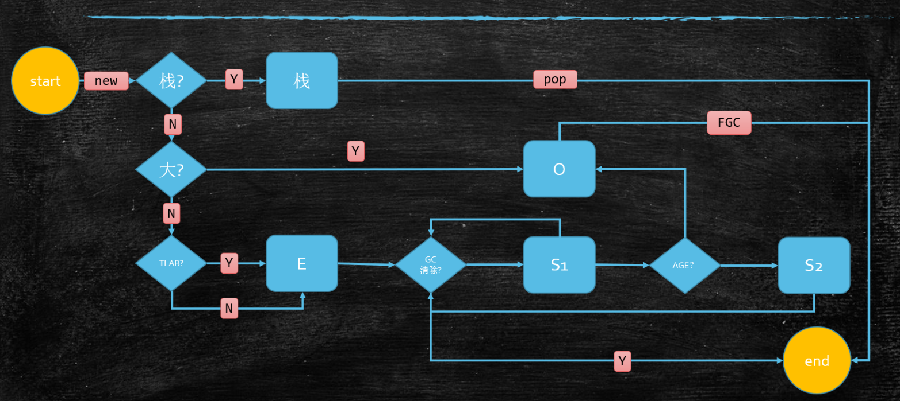

# JVM

## Class加载过程

### Loading

把class文件Load到内存中去。

#### 类加载器

##### Bootstrap 

加载最核心部分的类

##### ExtClassLoader

加载Extension扩展类

##### AppClassLoader

加载平时写的类

```java
package com.sqin.jvm.loader;

/*
 * 测试Java中各种类由哪一个类加载器进行加载的
 **/
public class ClassLoaderTest {

    public static void main(String[] args) {

        // 被Bootstrap加载到内存中的，由C++实现，Java里没有class和他对应，显示null
        // 加载最核心的jar包，rt.jar, charset.jar等
        System.out.println("String类的类加载器: " + String.class.getClassLoader());
        System.out.println("ClassLoader类的类加载器: " + ClassLoader.class.getClassLoader());

        // sun.misc.Launcher$ExtClassLoader@677327b6
        // 加载扩展包里的，jre/lib/ext下的jar
        System.out.println("扩展包里类的类加载器:" + sun.net.spi.nameservice.dns.DNSNameService.class.getClassLoader());

        System.out.println("=======================================================================================");
        // =======================================================================================
        // sun.misc.Launcher$AppClassLoader
        // 平时用的类加载器
        System.out.println("当前类（平常用的类）的类加载器: " + ClassLoaderTest.class.getClassLoader());

        // AppClassLoader类的加载器：null 是由Bootstrap加载进来
        System.out.println("AppClassLoader类的加载器: " + ClassLoaderTest.class.getClassLoader().getClass().getClassLoader());

        // AppClassLoader类的Parent：sun.misc.Launcher$ExtClassLoader@677327b6
        // 这里的Parent既不是AppClassLoader类的加载器，也不是他的父类
        System.out.println("AppClassLoader类的Parent: " + ClassLoaderTest.class.getClassLoader().getParent());


        System.out.println("=======================================================================================");
        // 根据Launcher源码，可以得出Bootstrap加载的类的路径
        String pathBoot = System.getProperty("sun.boot.class.path");
        System.out.println("Bootstrap加载的jar包: ");
        System.out.println(pathBoot.replaceAll(";", System.lineSeparator()));
        System.out.println();
        // 根据Launcher源码，可以得出ExtClassLoader加载的类的路径
        String pathExt = System.getProperty("java.ext.dirs");
        System.out.println("ext加载的jar包: ");
        System.out.println(pathExt.replaceAll(";", System.lineSeparator()));
        System.out.println();
        // 根据Launcher源码，可以得出AppClassLoader加载的类的路径
        String pathApp = System.getProperty("java.class.path");
        System.out.println("app加载的jar包: ");
        System.out.println(pathApp.replaceAll(";", System.lineSeparator()));
        System.out.println();

        System.out.println("===============================手动load一个类===============================");
        Class clazz = null;
        try {
            // 手动load一个类
            clazz = MyClassLoader.class.getClassLoader().loadClass("com.sqin.jvm.loader.MyClassLoader");
            System.out.println(clazz.getName());
        } catch (ClassNotFoundException e) {
            e.printStackTrace();
        }

    }

}
```

##### 自定义ClassLoader

继承ClassLoader， 重写findClass方法。在热部署，Spring动态代理，都是需要使用自己去加载这些新的类。

1，重写自定义ClassLoader的构造方法，可以指定Parent。

```java
MyClassLoader(){
    super(new MyClassLoaderParent());
}
```

2，重写findClass方法是不能打破双亲委派机制的，需要重写loadClass方法

#### 双亲委派机制

##### 什么是双亲委派机制

在加载Class文件时，会通过类加载器的parent（这里的parent不是父类，也不是父类加载器，仅仅是一个成员变量，指向上一级类加载器）进行查找（每个类加载器会把加载到内存中的类缓存起来），如果找不到，继续往上查找，如果Bootstrap还是找不到，才会去加载这个类，加载的时候由上往下，如果这个类不归Bootsrap加载，他会指派ExtClassLoader去加载，一直往下，如果找不到这个class，报ClassNotFoundException。

##### 为什么要用双亲委派机制

主要是为了安全性

#### LazyLoading

```java
package com.sqin.jvm.loader;

/*
 * @Author Sheng Qin
 * @Description 需要这个类的时候，类才会被加载进内存
 * @Date 0:37 2021/5/28
 **/
public class LazyLoading {

    public static void main(String[] args) {
        // 访问final值的时候，P类并没有到initializing
//        System.out.println(P.i);

        // 这里没有new，没有访问P类也不会被加载
//        P p;

        // 在访问类静态成员变量时，类已经被加载且initializing完成
//        System.out.println(P.j);

        try {
            Class.forName("com.sqin.jvm.loader.LazyLoading$P");
        } catch (ClassNotFoundException e) {
            e.printStackTrace();
        }
    }

    public static class P {
        final static int i = 9;
        static int j = 8;
        // 静态语句块会在initializing的步骤执行，只要P类被加载，P肯定会被打印
        static {
            System.out.println("P");
        }
    }

    public static class X extends P {
        static {
            System.out.println("X");
        }
    }

}

```


### Linking

#### Verification

校验加载到内存中的class文件是否符合class文件的标准。

#### Preparation

给静态变量赋默认值，这里是默认值，不是初始值，比如`static int i = 8`，在这一步会先赋一个默认值0给i。

#### Resolution

把class文件中常量池里面的符号引用，给它转换成内存地址，直接可以访问到内容了。

### Initializing

给静态变量赋初始值，比如刚才的i，在这一步会赋一个值为8。静态语句块也会在这一步被执行。

```java
package com.sqin.jvm.loader;

/*
 * @Description 给静态成员变量赋默认值和初始值
 **/
public class ClassLoaderProcedure {

    /**
     * 根据T类中两行代码的顺序不同，count值是不同的：
     * 如果T()在前，在T.class被load到内存中时，在preparation先给成员变量赋初始值，这时count为0，然后执行count++，count变为1
     *  再给count赋值，最后count为2
     * 如果count在前，先loading，然后preparation赋值为0，再resolution，再由initializing初始化赋初始值，先给count赋值为2，
     *  然后执行count++，最后count为3
     * @param args
     */
    public static void main(String[] args) {
        System.out.println(T.count);
    }

}

class T {
    public static T t = new T();
    public static int count = 2;

    // 这里的成员变量赋值也是需要两步的，第一步new对象的时候，申请内存，然后给m赋默认值0，在调用构造方法时，给他赋初始值8.
    private int m = 8;

    private T() {
        count++;
    }
}

```

## Java内存模型

### 对象布局

#### 普通对象

##### 对象头

8个字节，markword，里面包含了非常多的内容，主要是当前对象锁的情况，以及当前对象的垃圾回收的年龄。

##### ClassPoint指针

##### 实例数据

##### Padding

#### 数据对象

##### 对象头

##### ClassPoint指针

##### 数组长度

##### 数组数据

##### 对齐,padding

### 对象定位

#### 句柄池

#### 直接指针

### 对象分配



## Java运行时数据区

Java运行时数据区可以分为线程间共享和线程间隔离的

1，线程间共享的内存区域包括Heap堆和Method Area方法区。

2，线程间隔离的内存区域包括指令计数器Program counter，JVM Stacks（里面装的是栈帧，每个方法对应一个栈帧），Native method stacks

解析以下一个简单的Java类：

```java
package com.sqin.jvm.jmm;

/*
 *
 **/
public class TestStack {

    public static void main(String[] args) {
        int i = 8;
        i = i++;
        System.out.println(i);
    }
}

```

```bash
// 以下是main方法的字节码
# bipush The immediate byte is sign-extended to an int value. That value is pushed onto the operand stack. 
# istore_n The <n> must be an index into the local variable array of the current frame (§2.6). The value on the top of the operand stack must be of type int. It is popped from the operand stack, and the value of the local variable at <n> is set to value.
# iload_n The <n> must be an index into the local variable array of the current frame (§2.6). The local variable at <n> must contain an int. The value of the local variable at <n> is pushed onto the operand stack.
# iinc The index is an unsigned byte that must be an index into the local variable array of the current frame (§2.6). The const is an immediate signed byte. The local variable at index must contain an int. The value const is first sign-extended to an int, and then the local variable at index is incremented by that amount.
 0 bipush 8	# 把8压栈
 2 istore_1	# 把8赋给1位置的参数，这里就是i	到这里对应的是int i = 8;
 
 3 iload_1	# 把局部变量表1位置的参数i的值再放到栈中，就是8
 4 iinc 1 by 1	# 给本地变量表中1位置的数字+1，就是把i的值从8变成了9
 7 istore_1	# 把8赋给1位置的参数，这里就是i	到这里对应的是int i = 8;	到这里对应的是 i = i++;
 
 8 getstatic #2 <java/lang/System.out>
11 iload_1	# 把局部变量表1位置的参数i的值再放到栈中，就是8
12 invokevirtual #3 <java/io/PrintStream.println>	到这里对应的是打印
15 return
```


## 垃圾回收

### 基础知识

#### 一个对象的一生

##### 栈上分配

在栈上分配的对象用完后直接POP就结束一生了，一般这一块在JVM调优中不会调整。

优点：速度快

```md
线程私有的小对象
无逃逸（只在某一段代码中使用）见代码：
支持标量替换，意思是用普通的属性，普通的类型代替对象
```

##### 本地分配

TLAB（Thread Local Allocation Buffer）这一块也是属于Eden区，每个线程都独有一小块空间，一般为Eden区的1%，分配对象时不需要考虑到多线程的同步问题。

实验：

```java
package com.sqin.jvm.gc;

/*
 * @description: 测试去掉逃逸分析，标量替换，TLAB后，执行速度的区别。
 * -XX:-DoEscapeAnalysis
 * -XX:-EliminateAllocations
 * -XX:-UseTLAB
 **/
public class EscapeAnalysis {

    class User {
        int id;
        String name;

        public User(int id, String name) {
            this.id = id;
            this.name = name;
        }
    }

    void alloc(int i) {
        new User(i, "name " + i);	// 逃逸分析，标量替换
    }

    public static void main(String[] args) {
        EscapeAnalysis ea = new EscapeAnalysis();
        long start = System.currentTimeMillis();
        for(int i=0; i<10000000; i++){
            ea.alloc(i);
        }
        long end = System.currentTimeMillis();
        System.out.println(end - start);
    }


}
```


##### 直接进入Old区

如果这个对象特别大，直接进入Old区，FGC后才会结束。

##### 进入Eden区

分配到Eden区后，由GC清除，如果清除完成，则结束，如果没有清除进入s1，再进入s2，如此反复，在年龄够了后进入Old区，由FGC继续清除。


#### 什么是垃圾

没有任何引用指向的对象

#### 如何定位垃圾

1，引用计数，在对象的头上会有一个数字，表示有几个引用指向它，当数字为0时，对象就成了垃圾。缺点是解决不了循环依赖的问题。

2，根可达算法，顺着根对象一直往下找，找到的对象标记起来，其他的全部是垃圾。

根对象包括：

线程栈变量：主程序就是Main线程栈中的变量调用了其他方法，main栈中的方法访问到的对象就是根对象

静态变量：T.class对静态变量初始化，能够访问的对象

常量池：如果一个class能够用到其他的class的对象

JNI指针：本地方法，比如C++方法运行运用到了本地的对象

#### 常见的垃圾回收算法

1，标记清除 - 第一次扫描标记，第二次扫描清除，且清除后的内存不连续，碎片化

2，拷贝算法 - 没有碎片，浪费空间

3，标记压缩 - 没有碎片，效率低下（两遍扫描，还需要调整指针的指向）

拷贝算法，适合存活对象较少的内存空间，新生代

标记清除，标记压缩适合存活对象较多，老年代

#### 常用垃圾回收器

1，Serial + SerialOld 串行回收，单线程，最早时期的垃圾回收器，效率低下。

2，Parallel Scavenge + Parallel Old 串行回收，多线程，比Serial提高了效率。

3，ParNew + CMS 老年代并发执行，降低STW时间，ParNew就是在原来PS的基础上为了配合CMS做了改进

PN以响应时间优先，PS吞吐量优先。

4，G1

5，ZGC

### CMS(Concorrent mark sweep)

CMS是一个里程碑式的东西，在它之前，所有的垃圾回收器在工作时，其他工作线程都不能干活。

#### CMS四个阶段

1，初始标记

2，并发标记

3，重新标记

4，并发清除

#### CMS缺点
